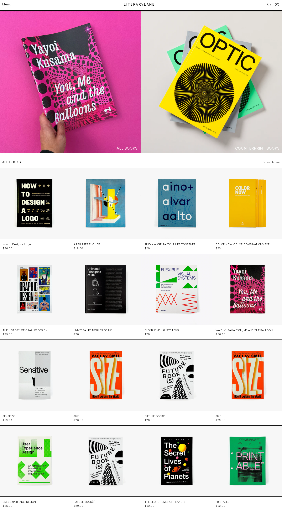

# Literary Lane - Book Buying Website

**Literary Lane** is a web application built using Next.js, Zustand for state management, MongoDB for the database, Tailwind CSS for styling, GSAP for animations, and SVG filters to enhance the user experience. It is a clone of the Counter-Print website and serves as a platform for buying books. This project showcases my skills in front-end development, user interface design, state management, and integration with a backend database.

## Table of Contents

- [Demo](#demo)
- [Features](#features)
- [Technologies Used](#technologies-used)
- [Installation](#installation)
- [Usage](#usage)
- [File Structure](#file-structure)
- [Project Highlights](#project-highlights)
- [Contact](#contact)

## Demo

You can view a live demo of the Literary Lane website [here](https://literarylane.vercel.app/).

## Features

- Browse and search for a wide variety of books.
- View detailed information about each book, including its title, price, and description.
- Add books to your shopping cart and proceed to checkout.
- Use SVG filters to add engaging animations and visual effects.
- Smooth animations using GSAP library.
- Clean and responsive design for a seamless user experience.
- Integration with MongoDB to manage book data.

## Technologies Used

- Next.js: A React framework for building server-rendered applications.
- Zustand: A state management library that simplifies managing state in React applications.
- MongoDB: A NoSQL database used for storing and retrieving book data.
- Tailwind CSS: A utility-first CSS framework for building responsive and modern designs.
- GSAP: A library for creating high-performance animations.
- SVG Filters: Used to enhance animations and visual effects.

## Installation

1. Clone the repository to your local machine.
2. Install dependencies using `npm install`.

## Usage

1. Configure MongoDB connection settings in the project.
2. Run the development server using `npm run dev`.
3. Access the website in your browser at `http://localhost:3000`.

## File Structure

The project follows a clean and organized file structure, making it easy to navigate and maintain.
